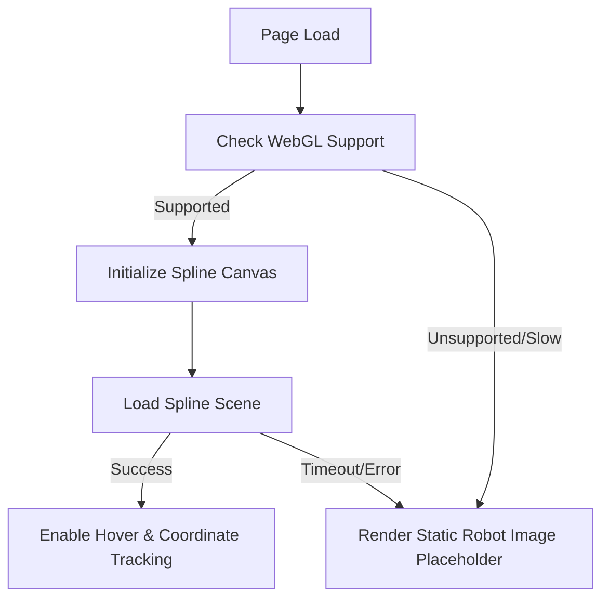

# P6 Hero Section & Loader Specification

This document defines the architectural, performance, responsive, and accessibility specifications for the Robotics Club V3 Hero Section and Session-Aware Loader.

---

## 1. Hero Section Layout Architecture
The final layout merges the structural elegance of the **V2 layout** with the high-tech aesthetic of the **V1 glitch tagline**.

### 1.1 Structural Structure (V2 Framework)
* **Double-Column Grid:** A responsive `1fr 1.2fr` split grid on desktop.
  * **Left Column:** Copywriting hierarchy, action buttons, and recruitment badges.
  * **Right Column:** Spline 3D viewport canvas / Static robot placeholder.
* **Header Spacing:** Generous padding-top (`180px`) to account for the sticky glassmorphic navbar.
* **Action Block:** Side-by-side buttons using glassmorphic gradients matching the active theme.

### 1.2 Interactive Glitch Tagline (V1 Animation)
* The tagline uses a custom CSS/JS terminal-style glitch sequence.
* **Animation Sequence:**
  1. On mount, characters resolve from binary code (`0`/`1`) to readable text.
  2. Random glitch scans occur every `4.5s`, temporarily replacing characters with cybernetic glyphs (`█`, `▓`, `_`, `^`, `$`).
  3. Styled with a cyber-orange neon drop shadow:
     ```css
     text-shadow: 0 0 8px var(--accent-orange-glow);
     ```

### 1.3 Discovery Scroll Cue
* To assist users in discovering the next section of the website, a subtle visual scroll cue is integrated at the absolute bottom center of the Hero viewport.
* **Visual Representation:** Animated down-pointing chevron icon or text reading `Explore ↓`.
* **Behavior:** Fades in after the Hero section completes its mounting transition. Bounces slowly (using CSS keyframe translation). Clicking the scroll cue triggers a smooth scroll to the subsequent section (via Lenis scroll engine).

---

## 2. Spline 3D Robot Integration Strategy
The centerpiece of the Hero section is the interactive 3D metallic robot model.



### 2.1 Event Tracking & Mouse Interaction
* **Coordinate Pointer Tracking:** The robot’s head coordinates dynamically track the user's mouse cursor across the viewport.
* **Hover State Triggers:** 
  * Hovering over buttons sends triggers to the Spline runtime to play minor mechanical spin animations.
  * Clicking action buttons triggers a subtle robotic salute action.

---

## 3. Session-Aware Loader Flow
To protect the user experience from repetitive intro sequences, the loader runs **exactly once per session** (persisted using `sessionStorage`).

### 3.1 Loader Branding
The loader presents a high-fidelity branded presentation to represent the premium identity of the club:
```text
ROBOTICS CLUB AVV

Initializing Innovation...
```

### 3.2 Loading Sequence
```
[Visit Page]
    │
    ├── Check sessionStorage.getItem('intro_seen')
    │
    ├─── Yes ───► Skip Loader ──► Mount Hero Directly
    │
    └─── No ────► Render Loader Sequence
                      │
                      ├── 1. Initial Glitch Reveal (Branding text decryptions)
                      ├── 2. Decrypting Assets (Percentage indicators)
                      ├── 3. System Ready fade out (90% - 100%)
                      │
                      └── Set sessionStorage('intro_seen', 'true')
```

---

## 4. Responsive Hierarchy & Breakpoints

To preserve the brand identity across form-factors, the robot is shown on all viewports, utilizing a static raster fallback on mobile screens to save GPU battery.

| Breakpoint | Layout Grid | Spline Robot / Placeholder | Tagline Font Size |
| :--- | :--- | :--- | :--- |
| **Desktop** ($\ge 1024\text{px}$) | `1fr 1.2fr` grid | Full 3D interactive model (Active coordinate tracking) | `1.15rem` (spaced) |
| **Tablet** ($768\text{px} - 1023\text{px}$) | Single column | Reduced 3D model (Scaled down, tracking disabled) | `1.0rem` |
| **Mobile** ($< 768\text{px}$) | Stacked layout | **Static Robot Image Placeholder** (WebP/PNG render) | `0.9rem` |

---

## 5. Theme Compatibility

### 🌌 Cosmic (Default)
* **Accents:** Neon Orange (`#ff6b35`) & Electric Purple (`#7c3aed`).
* **Robot Lighting:** Warm orange spotlights with violet ambient backlighting.

### 🔋 Aurora
* **Accents:** Emerald Green (`#10b981`) & Cyber Teal (`#06b6d4`).
* **Robot Lighting:** Mint ambient shadows with cyan edge highlights.

### 🛸 Deep Space (Monochrome)
* **Accents:** Slate White (`#f5f5f5`) & Dark Chrome (`#334155`).
* **Robot Lighting:** Pure white spotlights with metallic gray reflections.

---

## 6. Performance & Optimizations
* **Dynamic Imports:** The Spline player is lazy-loaded using Next.js `dynamic`:
  ```javascript
  const Spline = dynamic(() => import('@splinetool/react-spline'), {
    ssr: false,
    loading: () => <RobotPlaceholderImage />
  });
  ```
* **Pre-rendering Placeholder:** A high-quality static WebP render of the robot is loaded during asset decryption, ensuring zero Layout Shift (CLS) when the 3D scene mounts.

---

## 7. Accessibility (Reduced Motion)
To comply with WCAG 2.1 guidelines and ensure comfortable experiences for all users:
* **Media Query Detection:** The system actively monitors `@media (prefers-reduced-motion: reduce)`.
* **Adjusted Behavior:**
  * **Glitch Scans:** Disabled entirely; tagline remains statically rendered in clean text.
  * **Robot Head Tracking:** Mouse tracking coordinate listeners are unregistered; the robot remains in its default forward-facing posture.
  * **Loader Screen:** Transitions are instantaneous (opacity changes without slide, rotate, or decrypt matrix effects).

---

## 8. Risks & Fallback Matrix

> [!WARNING]
> WebGL context loss or failure to load 3D assets must not crash the landing page.

| Risk Scenario | Detection | Fallback Action |
| :--- | :--- | :--- |
| **No WebGL Support** | `canvas.getContext('webgl')` is null | Render the static Robot Image placeholder. |
| **Network Timeout** | Spline asset fetch exceeds `4.5s` | Gracefully fade out loader, render static Robot Image placeholder, mount rest of DOM. |
| **Context Loss** | `webglcontextlost` event fires | Stop the canvas rendering loop, smoothly crossfade to static Robot Image placeholder. |
