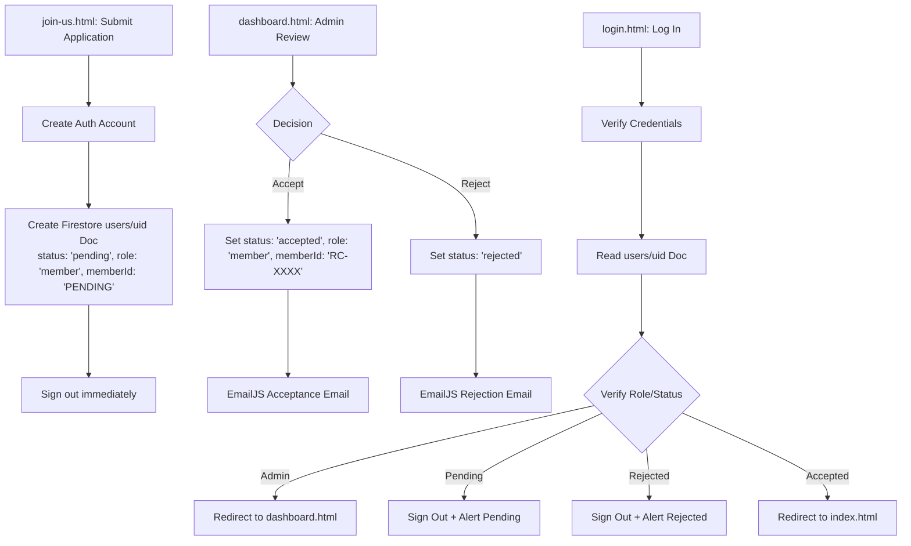

# Phase S1 - Architecture Discovery Report

This report presents a comprehensive architectural audit of the Robotics Club Website Version 1 (source of functionality and business logic) and Version 2 (architectural, engineering, and visual source). It defines the migration pathway to combine V1 functional requirements with V2 engineering standards in the upcoming V3 target codebase.

---

## Part 1 — Version 1 Audit

The functional codebase (`current-v1`) is built using a decentralized, static multi-page architecture powered by client-side Javascript and the Firebase Web SDK.

### Technology Stack

*   **HTML**: HTML5 semantic structure containing client-rendered script modules.
*   **CSS**: Tailwind CSS imported via CDN script (`https://cdn.tailwindcss.com`) and custom sheets:
    *   [style.css](file:///c:/Hackathons/robotics-club-v3/current-v1/style.css): Global classes, typewriter keyframes, scroll styles, and modal overlays.
    *   [join-style.css](file:///c:/Hackathons/robotics-club-v3/current-v1/join-style.css): Custom Typeform-style step transition transitions, grids, and progress indicators.
*   **Javascript**: Native ES modules using client-side imports.
*   **Firebase SDK Version**: `10.7.1` Web SDK, imported directly via CDN (`https://www.gstatic.com/firebasejs/10.7.1/...`). Specifically consumes:
    *   `firebase-app.js` (Core app initialization)
    *   `firebase-auth.js` (Client-side auth monitoring and credentials actions)
    *   `firebase-firestore.js` (Firestore client queries, real-time fetching, transaction increments)
*   **External Libraries**:
    *   **DiceBear Avatars**: Neutral Bottts API (`https://api.dicebear.com/9.x/bottts-neutral/svg?seed=${user.uid}`) for automatic profile avatar rendering.
    *   **EmailJS SDK**: Client-side mailing library imported via CDN `https://cdn.jsdelivr.net/npm/@emailjs/browser@3/dist/email.min.js`.
*   **EmailJS Integration**: Inlined within [dashboard.html](file:///c:/Hackathons/robotics-club-v3/current-v1/dashboard.html#L280-L323) and configured via [mail-config.js](file:///c:/Hackathons/robotics-club-v3/current-v1/mail-config.js) and [mail.js](file:///c:/Hackathons/robotics-club-v3/current-v1/mail.js). It handles member status notifications on status changes (Acceptance / Rejection).

### Page Inventory

1.  **`index.html`**
    *   *Purpose*: Public landing page. Details the club mission, training catalog, project spotlight, core team, media gallery, and dynamically loads upcoming events.
    *   *Dependencies*: [style.css](file:///c:/Hackathons/robotics-club-v3/current-v1/style.css), [script.js](file:///c:/Hackathons/robotics-club-v3/current-v1/script.js), [auth.js](file:///c:/Hackathons/robotics-club-v3/current-v1/auth.js), [firebase-config.js](file:///c:/Hackathons/robotics-club-v3/current-v1/firebase-config.js), [events.js](file:///c:/Hackathons/robotics-club-v3/current-v1/events.js), Google Fonts (Inter, Orbitron).
    *   *Scripts*: `script.js` (modals and typewriter logic) + inline ES module (auth state listener, events rendering, borrowed hardware lookup).
2.  **`login.html`**
    *   *Purpose*: Member identity authentication.
    *   *Dependencies*: [style.css](file:///c:/Hackathons/robotics-club-v3/current-v1/style.css), Tailwind CDN, [auth.js](file:///c:/Hackathons/robotics-club-v3/current-v1/auth.js).
    *   *Scripts*: Inline ES module triggering `loginUser` on form submission.
3.  **`join-us.html`**
    *   *Purpose*: Multi-step membership recruitment wizard (Typeform UX).
    *   *Dependencies*: [join-style.css](file:///c:/Hackathons/robotics-club-v3/current-v1/join-style.css), [join-script.js](file:///c:/Hackathons/robotics-club-v3/current-v1/join-script.js), [auth.js](file:///c:/Hackathons/robotics-club-v3/current-v1/auth.js).
    *   *Scripts*: `join-script.js`.
4.  **`dashboard.html`**
    *   *Purpose*: Protected Admin panel providing control centers for applicant review, event publishing, hardware inventory, and hardware allocations.
    *   *Dependencies*: Tailwind CDN, EmailJS SDK, [firebase-config.js](file:///c:/Hackathons/robotics-club-v3/current-v1/firebase-config.js), [auth.js](file:///c:/Hackathons/robotics-club-v3/current-v1/auth.js), [events.js](file:///c:/Hackathons/robotics-club-v3/current-v1/events.js), [inventory.js](file:///c:/Hackathons/robotics-club-v3/current-v1/inventory.js).
    *   *Scripts*: Inline ES module handling tab selections, data bindings, and action hooks.
5.  **`setup-admin.html`**
    *   *Purpose*: Admin bootstrapper to promote standard user accounts to admin status directly in Firestore.
    *   *Dependencies*: [firebase-config.js](file:///c:/Hackathons/robotics-club-v3/current-v1/firebase-config.js), Firebase Auth + Firestore SDK.
    *   *Scripts*: Inline script promoting input user.
6.  **`debug.html`**
    *   *Purpose*: Database debugger that dumps all documents within the `users` collection to check fields.
    *   *Dependencies*: [firebase-config.js](file:///c:/Hackathons/robotics-club-v3/current-v1/firebase-config.js), Firestore SDK.
    *   *Scripts*: Inline database dump query.
7.  **`test-mail.html`**
    *   *Purpose*: Standalone testing harness for EmailJS delivery metrics.
    *   *Dependencies*: [mail-config.js](file:///c:/Hackathons/robotics-club-v3/current-v1/mail-config.js), EmailJS CDN.
    *   *Scripts*: Inline test trigger script.

### Authentication Flow

1.  **Registration Hook**: Done via [join-script.js](file:///c:/Hackathons/robotics-club-v3/current-v1/join-script.js#L180-L220). Creating credentials automatically logs in the client. To bypass this, `registerUser` in [auth.js](file:///c:/Hackathons/robotics-club-v3/current-v1/auth.js#L33) immediately issues `signOut(auth)`.
2.  **Review Processing**: Profile is held with `status: 'pending'`, `role: 'member'`, and `memberId: 'PENDING'`.
3.  **Authentication Gate**:
    *   Admin reviews account details in [dashboard.html](file:///c:/Hackathons/robotics-club-v3/current-v1/dashboard.html).
    *   *Accept*: Firestore document values are updated (`status: 'accepted'`, `role: 'member'`, and a random `memberId` `'RC-XXXX'` is generated). EmailJS triggers acceptance notification.
    *   *Reject*: Firestore document value updated (`status: 'rejected'`). EmailJS triggers rejection notification. Option to delete profile document.
4.  **Logging In**:
    *   User authenticates at [login.html](file:///c:/Hackathons/robotics-club-v3/current-v1/login.html).
    *   Client runs `signInWithEmailAndPassword(auth, email, password)`.
    *   Profile document is fetched from `users/{uid}`:
        *   If `role === 'admin'`: Redirect to `dashboard.html`.
        *   If `status === 'pending'`: Force sign-out, alert "Access Denied: Pending approval", terminate.
        *   If `status === 'rejected'`: Force sign-out, alert "Access Denied: Rejected", terminate.
        *   If `status === 'accepted'`: Redirect to `index.html`.
5.  **Session Listener**: `onAuthStateChanged(auth)` maps states to active navigation layouts, populates user profile dropdowns, and loads active hardware allocations in real-time.



### Firestore Analysis

#### Collection Structures

1.  **`users`**
    *   `uid` (string, doc ID): Firebase Authentication user ID.
    *   `email` (string): College email address.
    *   `name` (string): Full name.
    *   `phone` (string): Primary contact.
    *   `branch` (string): Selected branch of study.
    *   `year` (string): Current year.
    *   `section` (string): College section.
    *   `interests` (string): Area of focus.
    *   `reason` (string): Motivation statements.
    *   `role` (string): `'member'` | `'admin'`.
    *   `status` (string): `'pending'` | `'accepted'` | `'rejected'`.
    *   `memberId` (string): `'PENDING'` | `'RC-XXXX'`.
    *   `createdAt` (string): ISO-8601 datetime format.
2.  **`events`**
    *   Document ID (auto-generated)
    *   `title` (string): Event name.
    *   `date` (string): Date in YYYY-MM-DD format (empty if Coming Soon).
    *   `comingSoon` (boolean): Flags coming soon timeline.
    *   `image` (string): Banner asset URL.
    *   `description` (string): Text content details.
    *   `link` (string): Registration link.
    *   `createdAt` (string): ISO-8601 creation datetime.
    *   `updatedAt` (string): ISO-8601 update datetime.
3.  **`inventory`** (Note: represented as `/hardware` in V1 rules)
    *   Document ID (auto-generated)
    *   `name` (string): Component description.
    *   `category` (string): Component grouping.
    *   `totalQuantity` (number): Total units cataloged.
    *   `availableQuantity` (number): Units currently in storage.
    *   `image` (string, optional): Image URL.
    *   `createdAt` (serverTimestamp): Document creation time.
    *   `updatedAt` (serverTimestamp): Document modification time.
4.  **`allocations`**
    *   Document ID (auto-generated)
    *   `userId` (string): Target borrower's Firebase Auth UID.
    *   `userName` (string): Target borrower's name.
    *   `memberId` (string): Member ID (`RC-XXXX`).
    *   `itemId` (string): Inventory document ID.
    *   `itemName` (string): Inventory item name.
    *   `expectedReturn` (string): Target return date.
    *   `status` (string): `'issued'` | `'returned'`.
    *   `issuedAt` (serverTimestamp): Timestamp when issued.
    *   `returnedAt` (serverTimestamp, optional): Timestamp when returned.

#### Schema Relationships

```
  [ users ] (uid) ◄───────── (userId)   [ allocations ] (itemId) ────────► (id) [ inventory ]
  [ users ] (memberId) ◄──── (memberId) ┘
```

#### Security Rules and Dependencies
As defined in [firestore.rules](file:///c:/Hackathons/robotics-club-v3/current-v1/firestore.rules):
*   Write permissions restrict operations (`events`, `inventory`, `allocations`) strictly to users where `users/{userId}.role == 'admin'`.
*   Users can read and write their own documents during user registration if `role == 'member'` and `status == 'pending'`.
*   *Defect Note*: V1 rules define `match /hardware/{hwId}` but the database queries target the `inventory` collection. V3 target specifications must reconcile this mismatch.

### Recruitment Workflow

```
[User Form Entry] ➔ [Firebase Auth Creation] ➔ [Firestore users/uid: pending] ➔ [Immediate Logout]
                                                                                      │
[Admin Action: ACCEPT] ◄──────────────────────────────────────────────────────────────┘
         │
         ├──➔ [Firestore Update: status='accepted', role='member', memberId='RC-XXXX']
         └──➔ [EmailJS API Call] ➔ [Acceptance Template (template_gbinztp) sent to member]
```

### Dashboard Analysis

*   **Applicant Management**: Lists registered users sorted by date. Shows summary statistics (total, pending, accepted). Includes buttons to ACCEPT, REJECT, and permanently DELETE rejected profiles.
*   **Event Management**: Creates and updates events. Binds form fields. Supports Comings Soon toggle which disables date selection and registration links. Lists active events with EDIT/DELETE buttons.
*   **Hardware Inventory**: Controls hardware inventory. Stores totals and tracks dynamic counts. Updates total quantity and sets available quantities during modification.
*   **Allocation Management**: Issues hardware using member identity lookups (`memberId` query). Filters items where `availableQuantity > 0`. On issue, writes an allocation record (set to `'issued'`) and triggers an atomic decrement (`increment(-1)`) of the item's `availableQuantity`. Handles returns by marking the record as `'returned'` and issuing `increment(1)` on the item's `availableQuantity`.

### Email System

The mailing modules ([mail-config.js](file:///c:/Hackathons/robotics-club-v3/current-v1/mail-config.js) and [mail.js](file:///c:/Hackathons/robotics-club-v3/current-v1/mail.js)) run entirely on the client.
*   **Mailing client**: EmailJS via browser SDK.
*   **Configuration tokens**: Service ID `service_eqt49es`, Public Key `py4w749i8WQem0P6c`.
*   **Templates**: Acceptance `template_gbinztp`, Rejection `template_tj1pez3`.
*   **Payload structure**: Uses a broad mapping strategy (binding values to `to_name`, `to_email`, `email`, `user_email`, `recipient`, `reply_to`, `member_id`, `interests`, `status`, `message`) to align with various template definitions.

---

## Part 2 — Version 2 Audit

The reference codebase (`reference-v2`) is built using Next.js, featuring CSS modules, global animations, and database operations mapped to a PostgreSQL backend via Supabase.

### Framework
*   **Next.js Version**: `16.1.6` (App Router structure).
*   **React Version**: `19.2.3`.

### Folder Structure

```
reference-v2/
├── public/                 # Static assets (3D Spline scene.splinecode, video backgrounds)
└── src/
    ├── app/                # App router pathways
    │   ├── api/            # API Route handlers (NextResponse)
    │   ├── dashboard/      # Admin dashboard page with nested component tabs
    │   ├── event/          # Public events view
    │   ├── join-us/        # Simple join form layout
    │   ├── login/          # Client-side authentication page
    │   ├── member/         # Members-only hub layout
    │   ├── globals.css     # CSS reset, variables, stacking sections, animations
    │   ├── layout.js       # Root layout defining dynamic Google Fonts metadata
    │   ├── error.js        # Global client error boundary page
    │   └── not-found.js    # Cinematic 404 route fallback
    ├── components/         # Page sections (Navbar, Hero, About, Projects, Team, Footer, Loading)
    │   └── ui/             # Reusable animated micro-components (AlertPopup, GlobalAlertContainer)
    ├── data/               # Static and mock databases (secretary_db.json)
    └── lib/                # Shared modules (alert-store, email interface, supabase client wrapper)
```

### Route Inventory

*   `GET /` - Public home directory. Contains Lenis scroll hooks and stack-pinned motion wrappers.
*   `GET /login` - Login form wrapper. Tracks auth states and maps roles to targets.
*   `GET /join-us` - Membership form layout posting to api/register.
*   `GET /dashboard` - Admin dashboard framework. Renders component tabs.
*   `GET /event` - Static events catalogue page.
*   `GET /member` - Protected member gateway dashboard.
*   `POST /api/register` - Privileged server registration endpoint. Auto-confirms email and inserts profiles.
*   `POST /api/applicants/update-status` - Updates application status.
*   `POST /api/applicants/update-role` - Updates user roles.
*   `POST /api/applicants/delete` - Deletes user documents.
*   `GET/POST /api/secretary/db` - Test endpoint returning mock databases.

### Component Inventory

#### Main Components (`src/components`)
*   `Navbar.js` / `Navbar.module.css`: Glass header navigation containing mobile hamburger drawers.
*   `Hero.js` / `Hero.module.css`: Lazy loads Spline WebGL elements, manages viewport triggers, and renders fallback cubes.
*   `About.js` / `About.module.css`: Two-column layouts with mission cards.
*   `Team.js` / `Team.module.css`: Core team profile cards with slide overlays and bio links.
*   `Events.js` / `Events.module.css`: Dynamically maps and displays active events.
*   `Projects.js` / `Projects.module.css`: Project grid cards featuring gradient glows.
*   `Footer.js` / `Footer.module.css`: Dynamic social links, contact coordinates, and status bars.
*   `LoadingScreen.js` / `LoadingScreen.module.css`: Interactive session-based terminal simulation.

#### Reusable UI Components (`src/components/ui`)
*   `AlertPopup.jsx`: Controlled modal containing warn symbols and proceed buttons.
*   `GlobalAlertContainer.jsx`: Framer Motion overlay listening to custom alert stores.
*   `infinite-moving-cards.jsx`: Loops client logos or cards.
*   `liquid-glass.jsx`: CSS mouse-glow effect containers.
*   `scroll-text.jsx`: Words fade in on scroll.

### API Architecture

*   Uses App Router route handlers (`export async function POST(request)`).
*   Utilizes the Supabase server client bypassing DB access rules (`createServerSupabaseClient` with service-role privileges).
*   Enforces basic validation limits, maps database exceptions, and returns standard JSON payloads:
    ```javascript
    return NextResponse.json({ error: 'System error message' }, { status: 500 });
    ```

### Error Handling

*   **`error.js`**: Global client boundary catching runtime exceptions. Displays custom error status boxes (`SYSTEM_ERROR // CRITICAL_FAILURE`), sanitizes error properties, and triggers resets.
*   **`not-found.js`**: Signal-lost 404 template. Renders large blurred 404 indicators alongside return-to-base navigation options.
*   **`loading.js`**: Route loading indicators that display before components mount.

### Alert System

*   **`alert-store.js`**: Custom pub-sub state channel. Holds a single listener. Exposes `showAlert()` and `showConfirm()` yielding Promises that resolve upon action (OK, Confirm, Cancel).
*   **`GlobalAlertContainer.jsx`**: Global layout wrapper subscribing to the alert store. Utilizes Framer Motion (`AnimatePresence` + spring transitions) to display premium alerts.
*   **`AlertPopup.jsx`**: Controlled popup component displaying generic warning dialogs with action callbacks.

### Theme Architecture

*   Reference V2 contains **no dynamic theme toggler**. Styling relies on custom Tailwind base layers (`@tailwind base`, `@tailwind components`, `@tailwind utilities`) integrated with CSS variable tokens defined in `:root` of `globals.css`.

### Performance Features

*   **Dynamic Imports**: Spline dependencies (`@splinetool/react-spline`) are lazy-loaded via `next/dynamic` with `ssr: false` to keep initial load times low.
*   **WebGL Unmounting**: Intersection Observers trace hero visual elements. If offscreen, WebGL canvas modules are unmounted to conserve GPU/CPU cycles.
*   **Fallback Placeholders**: A CSS-based 3D Rubik's cube fallback is rendered while Spline loads or when elements scroll offscreen.

---

## Part 3 — Migration Mapping

| Feature Area | Source (V1) | Reference (V2) | Migration Action (V3) | Rationale |
| :--- | :--- | :--- | :--- | :--- |
| **Authentication** | Firebase Web SDK Client Auth | Supabase Client Auth | **Preserve Firebase Client Auth** | Required constraint. Matches existing production credentials. |
| **Database** | Firestore Collections (users, events, inventory, allocations) | Supabase PostgreSQL tables | **Preserve Firestore Database** | Avoids database migration. Preserves Firestore collection structures. |
| **Security Gates** | Client-side routes checks based on Firestore query role checks | Client-side status checks + Supabase user queries | **Server-side token checks via Firebase Admin SDK** | Prevents client-side role manipulation. Verifies tokens securely. |
| **Recruitment Wizard** | Typeform-style wizard split-layout steps in HTML/CSS | Traditional form layout | **Recreate V1 Wizard as Next.js React Components** | Preserves V1 step-by-step UX while wrapping it in Next.js structure. |
| **API Endpoints** | Direct Client SDK Firestore writes | Supabase REST / Server Clients routes | **V3 Next.js Routes calling Firebase Admin SDK** | Secures database writes. Checks credentials on server side. |
| **3D Hero & Tagline** | Basic CSS Typewriter + Static banner image | 3D Spline scene lazy loader + CSS cube fallback | **Integrate V2 Spline with V1 Glitch Taglines** | Combines V2 premium 3D assets with V1 custom tagline texts. |
| **Gallery Page** | Infinite marquee slide loop + basic display modal | No active gallery | **Upgraded Masonry Grid with Lightbox** | Improves layout presentation. Uses lightbox modal overlays. |
| **Alert System** | Browser `alert()` / `confirm()` | Custom Alert Store + Global Alert Container | **Port V2 Alert System using Firebase workflows** | Standardizes modal layouts. Replaces browser fallback alert dialogs. |
| **Email system** | Direct client EmailJS calls in V1 dashboard / scripts | Basic fetch calls to server endpoints | **Secure Server-side or restricted client EmailJS calls** | Retains template keys inside private environments while preventing spam. |
| **Theme System** | Standard CSS rules | Token variables in `:root` CSS | **Dynamic Theme System (Cosmic, Aurora, Space)** | Adds custom theme classes and stores selected options. |

---

## Part 4 — Risks

### Architecture Risks
*   **React 19 Compatibility**: V2 uses React 19. If legacy modules or specific Firebase packages lack React 19 support, dependency resolve conflicts may arise during initialization.
*   **Hydration Mismatches**: Animations and theme initializers query local storage and document class structures. If client states differ from server-side render specs, layout issues can occur.

### Firebase Risks
*   **Direct Write Exploits**: If Firestore direct writes are allowed, malicious users could write directly to `users` or update statuses. Security rules must block direct writes for administrative collections.
*   **Admin SDK Setup**: Using Firebase Admin SDK inside Next.js API routes requires mapping private keys securely. Keys must be handled carefully using local environment variables (`.env.local`).

### Routing Risks
*   **Admin Redirect loops**: Admin checks must evaluate role states instantly to avoid rendering default layouts or causing redirect loops.
*   **Protected Gate Performance**: Reading Firestore on every page transition to verify admin status can impact performance. Session states should be cached locally.

### Security Risks
*   **EmailJS Key Exposure**: If API keys are public, unauthorized users could trigger emails. Access must be restricted.
*   **Firestore Rules Bug**: V1 rules check paths for `/hardware/{hwId}` while queries target `/inventory/{hwId}`. Writes will fail unless corrected to match the collection name.

### Deployment Risks
*   **WebGL Performance**: Spline loads ~600KB assets. On older mobile devices, WebGL could crash or freeze page elements. A clean fallback cube is required.

---

## Part 5 — Recommended V3 Architecture

```
                                  [ CLIENT SIDE (Next.js) ]
                                              │
                      ┌───────────────────────┼───────────────────────┐
                      ▼                       ▼                       ▼
              [ Public Pages ]        [ Member Portal ]       [ Admin Dashboard ]
                 (Home, /)                (/member)             (/dashboard)
                      │                       │                       │
                      ▼                       ▼                       ▼
             [ Firebase Client ]     [ Firebase Client ]     [ Firebase Client ]
              Auth State Check        Auth State Check        Auth State Check
                      │                       │                       │
                      └───────────────────────┼───────────────────────┘
                                              │ (Sends idToken in Auth Header)
                                              ▼
                                   [ NEXT.JS API ROUTES ]
                                    (/api/applicants/*)
                                              │
                                              ▼
                                   [ FIREBASE ADMIN SDK ]
                               (Verifies Token & Admin Claims)
                                              │
                                              ▼
                                    [ FIRESTORE DATABASE ]
```

### Route Structure
*   `app/page.js`: Landing page. Lazy-loads Spline visual elements and houses scrolling logic.
*   `app/login/page.js`: Client-side Firebase credentials check. Handles role-based redirects.
*   `app/join-us/page.js`: React-based recruitment wizard. Collects user input and registers via API.
*   `app/dashboard/page.js`: Tabbed layout containing tab components. Verified via API.
*   `app/member/page.js`: Core member portal. Fetches details using active auth credentials.
*   `app/event/[id]/page.js`: Detailed layout containing event information.
*   `app/api/register/route.js`: Creates credentials and Firestore profile documents.
*   `app/api/applicants/update-status/route.js`: Sets status, assigns IDs, and triggers EmailJS calls.
*   `app/api/applicants/delete/route.js`: Deletes target application documents.

### Component Structure

```
src/
├── components/
│   ├── Navbar.jsx             # Fixed glass header with user profile dropdown
│   ├── Hero.jsx               # Hero section (taglines + Spline canvas)
│   ├── About.jsx              # About us grid
│   ├── Projects.jsx           # Project cards
│   ├── Training.jsx           # Training cards (3D printing, Embedded systems, etc.)
│   ├── Events.jsx             # Active events grid
│   ├── Gallery.jsx            # Masonry layout with lightbox modal overlay
│   ├── Team.jsx               # Team grid with profile modals
│   ├── Footer.jsx             # Footer connects
│   └── Loader.jsx             # Session loader terminal simulation
└── components/ui/
    ├── AlertPopup.jsx         # Local alert popup modal
    ├── GlobalAlertContainer.jsx # Global alert listener overlay
    ├── SkeletonLoader.jsx     # Card loading skeleton fallbacks
    └── ThemeSwitcher.jsx      # Theme toggle dropdown
```

### Firebase SDK Architecture
*   **Client SDK**: Initialized in `src/lib/firebase.js` using client credentials. Provides auth listener and direct database reads for public collections.
*   **Admin SDK**: Initialized in `src/lib/firebase-admin.js` using environment variable configurations. Restricts database writes to server-side operations.

### API Architecture
Endpoints verify credentials using authorization headers before processing requests:
1.  Verify Token: `admin.auth().verifyIdToken(token)`.
2.  Verify Role: Query `/users/{uid}` and verify if `role === 'admin'`.
3.  Process Writes: Execute Firestore updates.
4.  Notification Hook: Trigger mail notifications on status changes.
