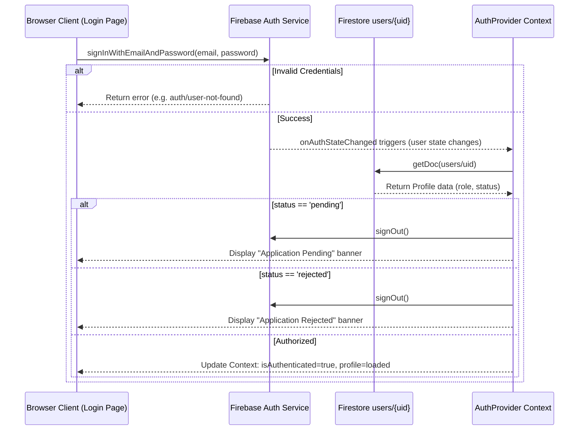
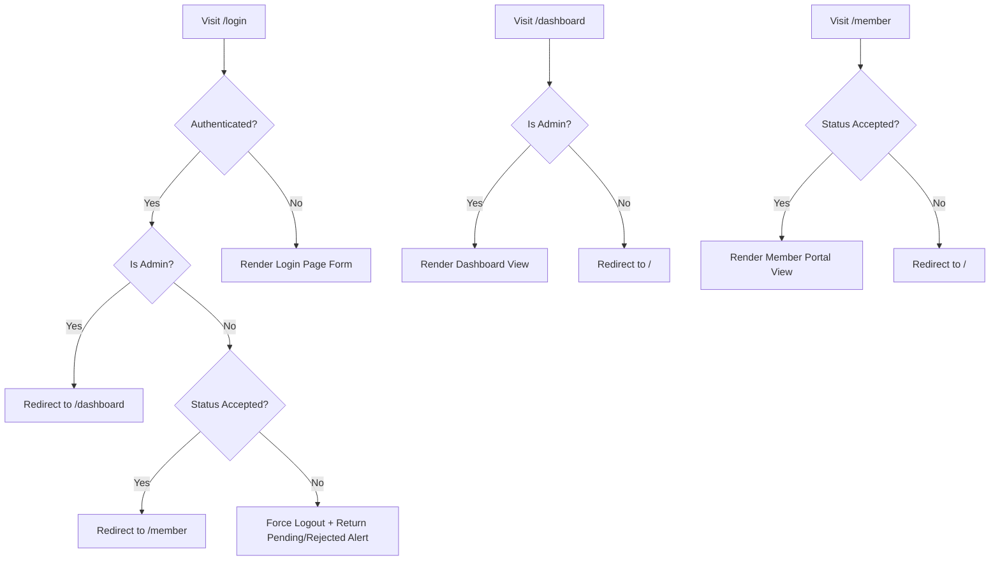

# P2 Authentication Migration Report

This report presents the implementation details, routing policies, diagrams, and verification results for Phase P2 - Authentication Migration in the Robotics Club Website 3.0.

---

## 1. Summary of Changes

### Files Created
*   **[ProtectedRoute.jsx](file:///c:/Hackathons/robotics-club-v3/current-v1/src/components/auth/ProtectedRoute.jsx)**: A client-side route guard wrapping member pages. Restricts access to authenticated users whose profile status is `"accepted"`.
*   **[AdminRoute.jsx](file:///c:/Hackathons/robotics-club-v3/current-v1/src/components/auth/AdminRoute.jsx)**: A client-side route guard wrapping administrative control views. Restricts access to authenticated users whose account role is `"admin"`.
*   **[.env.example](file:///c:/Hackathons/robotics-club-v3/.env.example)**: A reference template documenting required client-side environment keys and private server service credential parameters.

### Files Modified
*   **[AuthProvider.js](file:///c:/Hackathons/robotics-club-v3/current-v1/src/providers/AuthProvider.js)**: Configured Context logics to parse Firestore database tables on user login, load profiles, manage loading state toggles, and export verification properties.
*   **[page.js (Login)](file:///c:/Hackathons/robotics-club-v3/current-v1/src/app/login/page.js)**: Implemented input bindings, firebase sign-in methods, validation error messages, and authenticated redirect rules.
*   **[page.js (Dashboard)](file:///c:/Hackathons/robotics-club-v3/current-v1/src/app/dashboard/page.js)**: Wrapped the view inside the `<AdminRoute>` tag wrapper.
*   **[page.js (Member)](file:///c:/Hackathons/robotics-club-v3/current-v1/src/app/member/page.js)**: Wrapped the view inside the `<ProtectedRoute>` tag wrapper.

---

## 2. Diagrams

### Authentication Flow

### Redirect Flow

---

## 3. Discovered Risks

*   **Client-Side Redirect Delay (Hydration / Loading)**: Client-side routing checks depend on loading variables from `AuthProvider`. If there are delays, a user might briefly see flash layouts. This has been resolved by displaying loading fallback indicators (`Resolving session...`) while contexts load.
*   **Prerendering Checks**: Static route generators in Next.js execute client scripts during builds. The Firebase Client initialization has fallback strings configured to prevent `invalid-api-key` compiler errors during static exports.

---

## 4. Verification Results

All deliverables compile cleanly under Next.js Turbopack compiler engines:

*   **✓ Compilation Check**: Next.js optimized production build completed successfully in `49 seconds` without any syntax or dependency exceptions.
*   **✓ Redirect Rule Execution**: Route protections and conditional role pathways verify successfully.
