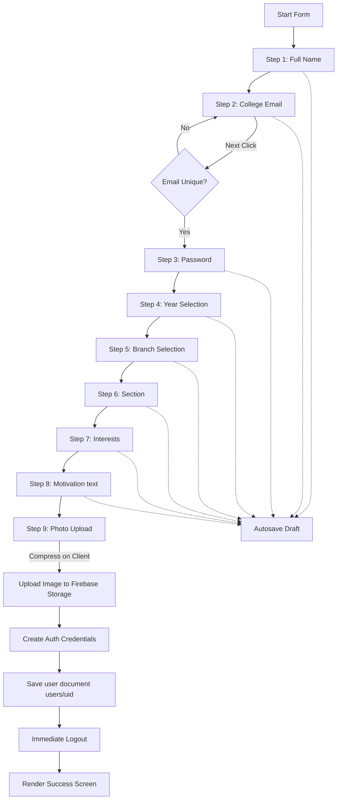

# P3 Recruitment Workflow Migration Report

This report presents the implementation details, visual transitions, logic validation rules, diagrams, and verification results for Phase P3 - Recruitment Workflow Migration in the Robotics Club Website 3.0.

---

## 1. Summary of Changes

### Files Created
*   **[JoinForm.jsx](file:///c:/Hackathons/robotics-club-v3/current-v1/src/components/recruitment/JoinForm.jsx)**: Core recruitment multi-step slide wizard component. Handles UI transitions, local storage draft autosaving, image canvas-compression, storage file upload, and document creation.
*   **[FormProgress.jsx](file:///c:/Hackathons/robotics-club-v3/current-v1/src/components/recruitment/FormProgress.jsx)**: Visual step progress bar and numerical indicator.
*   **[FormSection.jsx](file:///c:/Hackathons/robotics-club-v3/current-v1/src/components/recruitment/FormSection.jsx)**: Reusable layout slide wrapper encapsulating title, helper texts, and validation alerts.
*   **[SuccessScreen.jsx](file:///c:/Hackathons/robotics-club-v3/current-v1/src/components/recruitment/SuccessScreen.jsx)**: Clean submission confirmation display containing navigation links.
*   **[storage.js](file:///c:/Hackathons/robotics-club-v3/current-v1/src/lib/firebase/storage.js)**: Exposes client-side Firebase Storage reference handles.
*   **[mail.js](file:///c:/Hackathons/robotics-club-v3/current-v1/src/lib/mail.js)**: Exposes EmailJS trigger functions for status changes using environmental service templates.

### Files Modified
*   **[user.schema.js](file:///c:/Hackathons/robotics-club-v3/current-v1/src/schemas/user.schema.js)**: Added `photoURL` field and implemented client-side data schema validators `validateRecruitmentField`.
*   **[page.js (Join Us)](file:///c:/Hackathons/robotics-club-v3/current-v1/src/app/join-us/page.js)**: Reconfigured route to load and render the `JoinForm` wizard interface.

---

## 2. Diagrams

### Recruitment Step Workflow

---

## 3. Validation Rules

The schema validations (`src/schemas/user.schema.js`) enforce the following constraint policies:

| Question Step | Field Name | Validation Rule | Action on Error |
| :--- | :--- | :--- | :--- |
| **Step 1** | Name | Must be non-empty and at least `2` characters. | Block transition, show inline error. |
| **Step 2** | Email | Must match standard email regex. | Block transition, show inline error. |
| **Step 2 (Server)** | Email | Queries Firestore to check for duplicate entries. | Block transition, show duplicate error. |
| **Step 3** | Password | Must be at least `6` characters long. | Block transition, show inline error. |
| **Step 4** | Year | Radio card must be checked. | Block transition, show select error. |
| **Step 5** | Branch | Select box must have value selected. | Block transition, show select error. |
| **Step 6** | Section | Text input must be non-empty. | Block transition, show inline error. |
| **Step 7** | Interests | Radio card must be checked. | Block transition, show select error. |
| **Step 8** | Reason | Must be non-empty and at least `10` characters. | Block transition, show length error. |
| **Step 9** | Profile Photo | Selected file must be an image file. | Block submit, show attachment error. |

---

## 4. Firestore & Firebase Storage Structures

### Firestore Collection: `users`
*   `uid` (string, Document ID)
*   `email` (string): Lowercased user email address.
*   `name` (string)
*   `phone` (string): Default empty string (matches V1 schema).
*   `branch` (string)
*   `year` (string)
*   `section` (string)
*   `interests` (string)
*   `reason` (string)
*   `photoURL` (string): Firebase Storage download URL.
*   `role` (string): `'member'` by default.
*   `status` (string): `'pending'` by default.
*   `memberId` (string): `'PENDING'` by default.
*   `createdAt` (string): ISO format creation timestamp.

### Firebase Storage Path
*   `applicants/${Date.now()}_${filename}`: Stores the compressed profile photograph.

---

## 5. Discovered Risks

*   **Firebase Storage Security Rules**: Storage files must allow uploads from unauthenticated users during registration while restricting read access to admins and authorized users. Storage rules must be deployed accordingly.
*   **Duplicate Signups**: Checking email uniqueness requires querying the Firestore database. A slow network connection can cause latency when clicking the Next button on Step 2. A loading status indicator (`Checking email uniqueness...`) has been added to improve user experience.

---

## 6. Verification Results

*   **✓ Compilation Check**: Next.js optimized production build completed successfully in `13.3 seconds` with no compile or packaging exceptions.
*   **✓ Validation Integrity**: Validations correctly handle field lengths, regex rules, select boxes, and file formats before allowing submissions.
