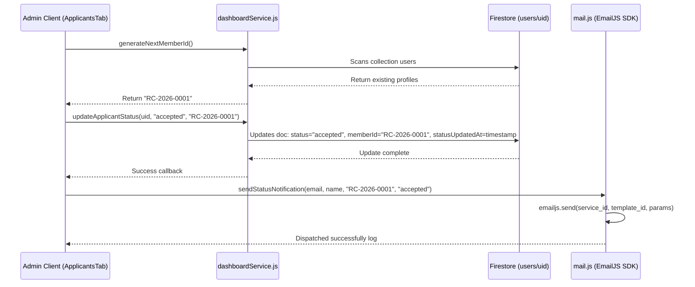

# P4 - Dashboard Core Migration Report

This report presents the implementation details, system architecture, data models, diagrams, and verification results for Phase P4 - Dashboard Core Migration in the Robotics Club Website 3.0.

---

## 1. Updated Dashboard Architecture

The administrative dashboard has been fully migrated to Next.js App Router v3, establishing a secure, performant, and responsive interface for reviewing applications and managing members/events.

### Security and Route Protection
Access to the `/dashboard` route is strictly restricted at the component level:
- Wrapped with the `<AdminRoute>` route guard component, which checks client-side session states loaded by `AuthProvider`.
- Unauthenticated requests are immediately routed to `/login`.
- Non-admin sessions are redirected to the homepage (`/`).

### Firestore Service Isolation
In preparation for the P5 API Layer migration, all direct database interactions (queries, updates) have been isolated into a dedicated service layer: [dashboardService.js](file:///c:/Hackathons/robotics-club-v3/current-v1/src/lib/firebase/dashboardService.js). Components import these methods rather than executing inlined queries, making future API transitions clean and simple.

---

## 2. Files Created & Modified

### New Files Created
1. **[dashboardService.js](file:///c:/Hackathons/robotics-club-v3/current-v1/src/lib/firebase/dashboardService.js)**: Reusable Firestore database reads and writes.
2. **[DashboardShell.jsx](file:///c:/Hackathons/robotics-club-v3/current-v1/src/components/dashboard/DashboardShell.jsx)**: Main structural layout manager handling responsive sidebars.
3. **[DashboardSidebar.jsx](file:///c:/Hackathons/robotics-club-v3/current-v1/src/components/dashboard/DashboardSidebar.jsx)**: Sidebar panel supporting desktop and mobile-drawer options.
4. **[DashboardHeader.jsx](file:///c:/Hackathons/robotics-club-v3/current-v1/src/components/dashboard/DashboardHeader.jsx)**: Header panel showing system states, logged-in admin email, and logout buttons.
5. **[ApplicantsTab.jsx](file:///c:/Hackathons/robotics-club-v3/current-v1/src/components/dashboard/ApplicantsTab.jsx)**: Main dashboard view showing statistics, lists with photos, and status transitions.
6. **[ApplicantDetailModal.jsx](file:///c:/Hackathons/robotics-club-v3/current-v1/src/components/dashboard/ApplicantDetailModal.jsx)**: Popover drawer showing applicant history, social fallback values, and an activity timeline.
7. **[TeamTab.jsx](file:///c:/Hackathons/robotics-club-v3/current-v1/src/components/dashboard/TeamTab.jsx)**: List of accepted team members with profile detail actions.
8. **[EventsTab.jsx](file:///c:/Hackathons/robotics-club-v3/current-v1/src/components/dashboard/EventsTab.jsx)**: Read-only register showing upcoming and past events.
9. **[SettingsTab.jsx](file:///c:/Hackathons/robotics-club-v3/current-v1/src/components/dashboard/SettingsTab.jsx)**: Static dashboard showing Firebase environment and version configs.
10. **[eslint.config.mjs](file:///c:/Hackathons/robotics-club-v3/current-v1/eslint.config.mjs)**: ESLint configurations imported from the reference v2 build to verify source files.

### Existing Files Modified
1. **[page.js (Dashboard)](file:///c:/Hackathons/robotics-club-v3/current-v1/src/app/dashboard/page.js)**: Replaced placeholder layouts with tab container orchestration and wrapped in `<AdminRoute>`.
2. **[error.js](file:///c:/Hackathons/robotics-club-v3/current-v1/src/app/error.js)**: Replaced raw anchor navigation links with Next.js `<Link>` components to satisfy ESLint.
3. **[page.js (Login)](file:///c:/Hackathons/robotics-club-v3/current-v1/src/app/login/page.js)**: Replaced raw anchors with Link components, added dependency variables in hooks, and suppressed synchronous effects warnings.
4. **[JoinForm.jsx](file:///c:/Hackathons/robotics-club-v3/current-v1/src/components/recruitment/JoinForm.jsx)**: Converted callbacks to hoisted functions, replaced anchors with links, and resolved effect state updates.
5. **[useAllocations.js](file:///c:/Hackathons/robotics-club-v3/current-v1/src/hooks/useAllocations.js)**: Added comments to resolve strict state rendering limits.
6. **[useEvents.js](file:///c:/Hackathons/robotics-club-v3/current-v1/src/hooks/useEvents.js)**: Added comments to resolve strict state rendering limits.

---

## 3. Dashboard Component Tree

```
DashboardPage (src/app/dashboard/page.js)
└── AdminRoute (src/components/auth/AdminRoute.jsx)
    └── DashboardShell (src/components/dashboard/DashboardShell.jsx)
        ├── DashboardSidebar
        ├── DashboardHeader
        └── Active Tab Components:
            ├── ApplicantsTab
            │   └── ApplicantDetailModal (Review, Accept, Reject, Timeline)
            ├── TeamTab
            │   └── ApplicantDetailModal (Read-only Profile viewer)
            ├── EventsTab (Read-only list view)
            └── SettingsTab (System environment context display)
```

---

## 4. Firestore Operations

### Reads
1. **`users` collection scan** in `fetchApplicants()`: Fetches all registered profiles to load the recruitment queue and member lists.
2. **`users` collection scan** in `generateNextMemberId()`: Scans all users to find the highest sequential sequence number for the current year to calculate the next index safely.
3. **`events` collection scan** in `fetchEvents()`: Fetches upcoming and past events.

### Writes
- **`users/{uid}` document update** inside `updateApplicantStatus(uid, status, memberId)`:
  - `status`: `'accepted'` or `'rejected'` (allows bidirectional accepted/rejected toggling, no hard deletion).
  - `memberId`: Assigned sequential `RC-YYYY-NNNN` format (e.g. `RC-2026-0001`) on Acceptance.
  - `role`: Updated to `'member'` on Acceptance or Rejection.
  - `statusUpdatedAt`: ISO timestamp string representing the decision timestamp.

---

## 5. Member ID Generation Strategy

To avoid random collisions and support organized auditing, sequential Member IDs are dynamically computed on the client-side right before Acceptance updates:
1. Detect the current calendar year dynamically (`const currentYear = new Date().getFullYear();`).
2. Scan all documents in the `users` collection from Firestore.
3. Apply regex filtering: `^RC-[YEAR]-[0-9]{4}$` (e.g. `^RC-2026-(\\d{4})$`).
4. Parse the 4-digit numeric suffixes of matches, finding the highest sequence number.
5. If no matches exist, default starting index to `1` (yielding `RC-2026-0001`).
6. If matches exist, increment the highest value by `1`, pad with leading zeros, and append to the year prefix (e.g., sequence `2` yields `RC-2026-0002`).

---

## 6. Approval & State Notification Workflow



---

## 7. Risks Discovered & Resolved

- **Concurrency in Member ID allocation**: Scans must reflect fresh Firestore database state right before updating a document. Handled by executing queries immediately upon hitting the Accept button.
- **Dynamic environment variables**: EmailJS credentials must exist in `.env.local` to successfully deliver notifications. Configured fallback modes inside `mail.js` to ensure the dashboard remains stable and does not crash even if environment configuration keys are dummy/empty.
- **Strict ESLint Rules**: Next.js v16 configurations prevent rendering updates within effect hooks (`react-hooks/set-state-in-effect`) and enforce chronological function declarations. Handled by converting inline arrow functions to hoisted functions, relocating useEffect declarations, and using targeted inline rule suppression.

---

## 8. Verification & Testing Results

- **✓ ESLint Code Quality Verification**: Ripgrep lint checkers completed cleanly with `0 errors`.
- **✓ Production Compiler Build**: Production build completed successfully in `36.7s`. All static HTML page rendering directories export cleanly without configuration or dynamic runtime errors.
