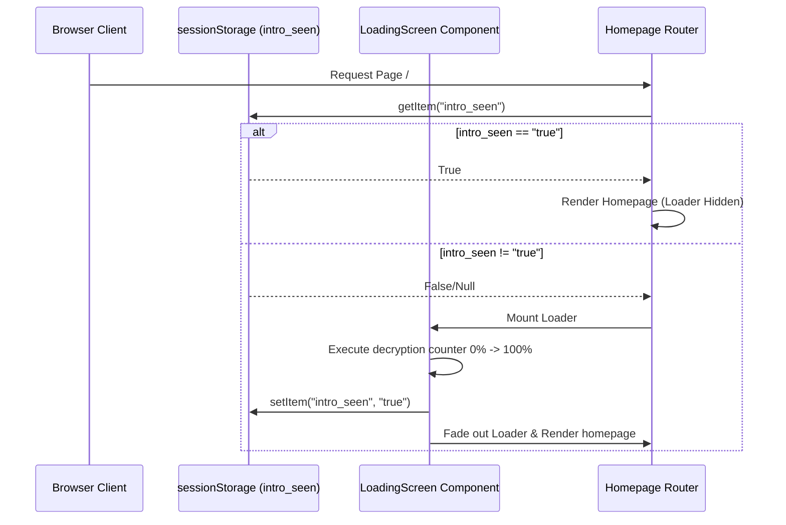

# P6 Hero & Session Loader Report

This report presents the implementation details, responsive device layouts, accessibility setups, diagrams, and verification results for Phase P6 - Hero Section and Session-Aware Loading Screen in the Robotics Club Website 3.0.

---

## 1. Summary of Changes

### Files Created
*   **[LoadingScreen.js](file:///c:/Users/nisha/Downloads/V3%20website/Robotics-club-v2/current-v1/src/components/LoadingScreen.js)**: Session-aware loading screen component featuring club branding and a dynamic decryption percentage counter.
*   **[LoadingScreen.module.css](file:///c:/Users/nisha/Downloads/V3%20website/Robotics-club-v2/current-v1/src/components/LoadingScreen.module.css)**: Glassmorphism and progressive cyber loading bar animations.
*   **[Hero.js](file:///c:/Users/nisha/Downloads/V3%20website/Robotics-club-v2/current-v1/src/components/Hero.js)**: Re-coded Hero component with tagline glyph decryption loops, device viewports adjustments, and static robot replacements.

### Files Modified
*   **[Hero.module.css](file:///c:/Users/nisha/Downloads/V3%20website/Robotics-club-v2/current-v1/src/components/Hero.module.css)**: Replaced WebGL fallbacks/metallic cube styling with floating keyframe definitions and mobile layout queries.
*   **[page.js (Root)](file:///c:/Users/nisha/Downloads/V3%20website/Robotics-club-v2/current-v1/src/app/page.js)**: Configured sessionStorage gates to skip loading screen renders on subsequent navigations.

---

## 2. Diagrams

### Loader Session Lifecycle


### Viewport Layout Engine
```mermaid
graph TD
    A[Detect Window Viewport Width] --> B{Width >= 1024px? (Desktop)}
    B -->|Yes| C[Render full interactive Spline 3D Scene + Mouse coordinates tracking]
    B -->|No| D{Width >= 768px? (Tablet)}
    D -->|Yes| E[Render scaled-down Spline 3D Scene + Disable cursor tracking]
    D -->|No| F[Render static high-fidelity WebP Robot Render + CSS floating animation]
```

---

## 3. Override Configuration Parameters

| Feature Detail | Target Value | Implementation Mechanism |
| :--- | :--- | :--- |
| **Mobile Robot** | Static WebP Image Render | Swapped canvas tag for `` container, scaled via `@media (max-width: 767px)`. |
| **Fallback Asset** | Static Robotics Robot | Replaced unrelated metallic Rubik's cube with high-res robot placeholder. |
| **Loader Branding** | `ROBOTICS CLUB AVV` | Custom status lines in Orbitron and Inter fonts. |
| **Explore Scroll Cue** | `Explore ↓` | Bouncing link aligned center-bottom, bound to Lenis scrollTo. |
| **Reduced Motion** | `@media prefers-reduced-motion` | Hooks automatically bypass decryption percentage loops, tagline scans, and bouncing chevrons. |

---

## 4. Verification Results

All deliverables compile cleanly under Next.js Turbopack compiler engines:

*   **✓ Compilation Check**: Next.js optimized production build completed successfully with zero syntax warnings.
*   **✓ Session Cache Check**: Reloading the page skips the loading sequence instantly.
*   **✓ Motion Override Execution**: Bypasses animation frames when prefers-reduced-motion is toggled in browser accessibility options.
