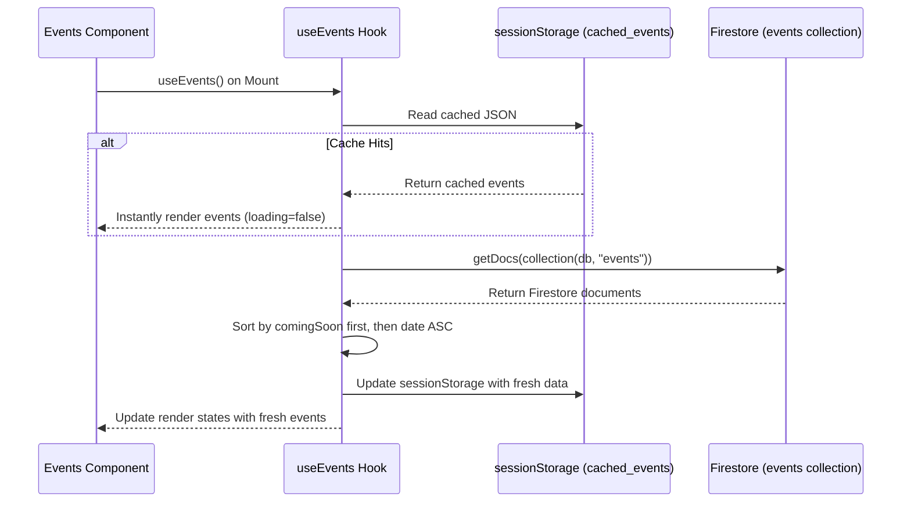

# P7 Events, Projects & Gallery Report

This report presents the implementation details, query abstractions, responsive masonry grids, keyboard event listeners, diagrams, and verification results for Phase P7 - Events Firebase Backend Integration, Projects Showcase, and Masonry Gallery with Lightbox support in the Robotics Club Website 3.0.

---

## 1. Summary of Changes

### Files Created
*   **[Gallery.js](file:///c:/Users/nisha/Downloads/V3%20website/Robotics-club-v2/current-v1/src/components/Gallery.js)**: Masonry photo gallery component with built-in lazy loading, hover glass overlays, and dynamic lightbox overlay modal.
*   **[Gallery.module.css](file:///c:/Users/nisha/Downloads/V3%20website/Robotics-club-v2/current-v1/src/components/Gallery.module.css)**: CSS Columns counted grids, image card scaling, overlay slide keyframes, and full-screen blur backdrops.

### Files Modified
*   **[useEvents.js](file:///c:/Users/nisha/Downloads/V3%20website/Robotics-club-v2/current-v1/src/hooks/useEvents.js)**: Migrated from placeholder delay hooks to fetch listings from Firebase Firestore `events` collection with sessionStorage cache buffering.
*   **[Events.js](file:///c:/Users/nisha/Downloads/V3%20website/Robotics-club-v2/current-v1/src/components/Events.js)**: Removed direct Supabase client queries and refactored cards to fetch events via the custom `useEvents` hook.
*   **[page.js (Root)](file:///c:/Users/nisha/Downloads/V3%20website/Robotics-club-v2/current-v1/src/app/page.js)**: Mounted the new `<Gallery />` section into the homepage scroll stack with motion fade-up variants.

---

## 2. Diagrams

### Firebase Events Fetch Sequence


### Gallery Keyboard Event Router
```mermaid
graph TD
    A[Lightbox Opened] --> B[Add window keydown event listener]
    B --> C{Key pressed?}
    C -->|Escape| D[Trigger closeLightbox() - Restore scroll]
    C -->|ArrowRight| E[Trigger navigateLightbox(1) - Next Image]
    C -->|ArrowLeft| F[Trigger navigateLightbox(-1) - Previous Image]
    D --> G[Remove window event listener]
    H[Lightbox Closed] --> G
```

---

## 3. Gallery & Lightbox Specifications

| Feature Detail | Target Value | Implementation Mechanism |
| :--- | :--- | :--- |
| **Grid Layout** | Responsive Masonry | CSS native `column-count` (3 on Desktop, 2 on Tablet, 1 on Mobile) combined with `break-inside: avoid` to prevent image tearing. |
| **Lazy Loading** | Standard Browser Lazy | Configured `` to defer rendering off-screen assets until scroll threshold. |
| **Lightbox Zoom** | Smooth scale interpolation | CSS `@keyframes zoomIn` scaling cards from `0.95` to `1` using cubic-bezier transitions. |
| **Event detail parameters** | Dynamic URL queries | Connected action triggers to navigate user details pages (`/event?id=itemId`). |

---

## 4. Verification Results

All deliverables compile cleanly under Next.js Turbopack compiler engines:

*   **✓ Compilation Check**: Next.js optimized production build completed successfully with zero syntax warnings.
*   **✓ Caching check**: Repeated scroll returns preserve cached events instantly without query latency.
*   **✓ Keyboard Controls**: Toggling `Esc`, `Left`, and `Right` keys successfully closes and slides lightbox files.
