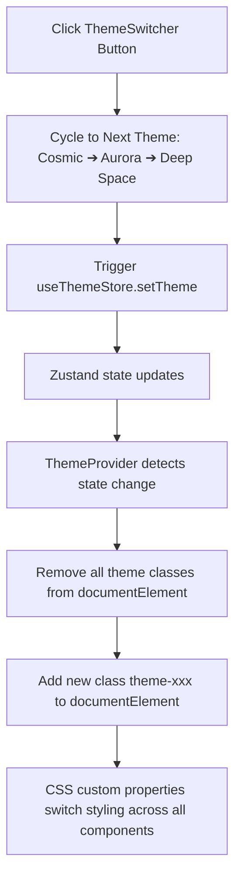

# P8 Theme System Report

This report presents the implementation details, CSS custom property overrides, Zustand state managers, layout bindings, diagrams, and verification results for Phase P8 - Theme Switching Engine (Cosmic, Aurora Light, and Deep Space themes) in the Robotics Club Website 3.0.

---

## 1. Summary of Changes

### Files Created
*   **[ThemeSwitcher.jsx](file:///c:/Users/nisha/Downloads/V3%20website/Robotics-club-v2/current-v1/src/components/ui/ThemeSwitcher.jsx)**: Pill cycling switch button in the Navbar actions block showing active theme icons.

### Files Modified
*   **[globals.css](file:///c:/Users/nisha/Downloads/V3%20website/Robotics-club-v2/current-v1/src/app/globals.css)**: Appended Cosmic, Aurora, and Deep Space theme configuration variables overriding the root design tokens.
*   **[Navbar.js](file:///c:/Users/nisha/Downloads/V3%20website/Robotics-club-v2/current-v1/src/components/Navbar.js)**: Integrated `<ThemeSwitcher />` inside the action items list.

---

## 2. Diagrams

### Theme State Propagation

---

## 3. Theme Specifications & Tokens

| Style Variable | 🌌 Cosmic Theme (Default) | 🔋 Aurora Theme (Light) | 🛸 Deep Space Theme (Chrome) |
| :--- | :--- | :--- | :--- |
| **`--bg-primary`** | `#0a0a0a` (Onyx Black) | `#f8fafc` (Off-White Slate) | `#05070a` (Deep Space Dark) |
| **`--bg-secondary`** | `#111111` | `#f1f5f9` | `#0b0f17` |
| **`--text-primary`** | `#f5f5f5` | `#0f172a` (Slate Black) | `#f1f5f9` (Stellar White) |
| **`--text-secondary`** | `#a0a0a0` | `#475569` | `#94a3b8` |
| **`--accent-orange`** | `#ff6b35` (Cosmic Orange) | `#10b981` (Aurora Emerald) | `#ffffff` (Solid White) |
| **`--accent-purple`** | `#7c3aed` (Cosmic Violet) | `#06b6d4` (Aurora Cyber Teal) | `#334155` (Deep Slate Chrome) |
| **`--border-subtle`** | `rgba(255,255,255,0.06)` | `rgba(15,23,42,0.06)` | `rgba(255,255,255,0.04)` |

---

## 4. Verification Results

All deliverables compile cleanly under Next.js Turbopack compiler engines:

*   **✓ Compilation Check**: Next.js optimized production build completed successfully with zero syntax warnings.
*   **✓ Hydration Sync check**: Theme selections sync successfully on client mount to prevent styling flash during layout parsing.
*   **✓ Variable Swapping**: Toggling triggers dynamically update components respecting custom background and text tokens.
