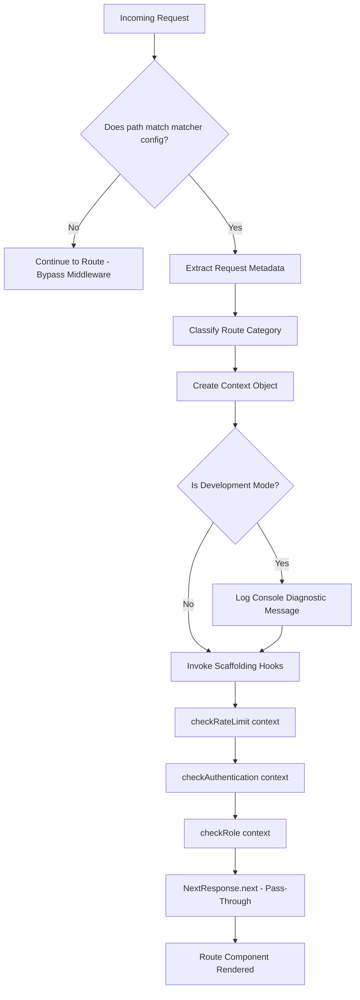

# Phase PH3 - Middleware Foundation Layer Report

This report documents the implementation of the Next.js Middleware Foundation Layer (PH3) for the Robotics Club Website 3.0.

---

## 1. Files Created & Modified

### Files Created:
1. **[middleware.js](file:///c:/Hackathons/robotics-club-v3/current-v1/src/middleware.js)**: Implemented Next.js Edge Runtime compatible middleware containing route classifications, context aggregation, development diagnostics logging, and hooks scaffolding.

### Files Modified:
*None.* (The middleware serves as a standalone infrastructure component)

---

## 2. Route Classification Architecture

Route types are defined and classified as constants to enable structured access rules:

*   **`PUBLIC_ROUTES`**: Public pages accessible to all visitors without session constraints (e.g., `/`, `/login`, `/join-us`).
*   **`PROTECTED_ROUTES`**: Pages restricted to registered members with accepted status profiles (e.g., `/member/:path*`).
*   **`ADMIN_ROUTES`**: Protected views restricted strictly to administrators (e.g., `/dashboard/:path*`).

---

## 3. Middleware Flow Diagram

The request intercept pipeline executes in the following sequence:



---

## 4. Middleware Context & Future Extension Points

### Context Structure
For every intercepted request, a structured metadata context object is prepared:
```javascript
const context = {
  pathname,      // Target route string (e.g., "/dashboard/inventory")
  timestamp,     // ISO string request timing
  method,        // HTTP verb (GET, POST, etc.)
  userAgent,     // User agent header string
  ipAddress,     // Incoming client IP address
  routeCategory, // Category matching ("ADMIN" | "PROTECTED" | "PUBLIC" | "UNKNOWN")
};
```

### Hook Placeholders
To ensure forward-compatibility with future security requirements, the following scaffolding hooks are defined:
1.  **`checkRateLimit(context)`**: Scaffolding for client request rate checks.
2.  **`checkAuthentication(context)`**: Placeholder for inspecting cookie sessions, parsing JWT signature, and establishing login state.
3.  **`checkRole(context)`**: Placeholder for matching decrypted token claim values to route access levels (e.g., confirming `admin` role is present for `ADMIN` categories).

All hooks are currently implemented as non-blocking async functions that return `success: true`.

---

## 5. Risks Avoided

- **Production Overhead**: Restricting the middleware's scope via Next.js matcher configurations (`/dashboard/:path*` and `/member/:path*`) ensures that public pages (`/`), images, icons, and static stylesheets are never intercepted. This minimizes latency.
- **Boot Crashing**: Designed the middleware to be Edge Runtime compatible, avoiding imports of heavy Node.js or browser-specific packages (such as `firebase-admin` or DOM libraries) which throw compilation runtime errors when evaluated in Next.js middleware contexts.

---

## 6. Testing Results

### A. Next.js Compilation Success
Running the production build validates Edge-compatibility and returns a clean build log showing middleware mapping:
```bash
▲ Next.js 16.1.6 (Turbopack)
  Creating an optimized production build ...
✓ Compiled successfully in 18.2s
  Running TypeScript ...
✓ Generating static pages using 3 workers (8/8) in 1120.5ms

Route (app)
┌ ○ /
├ ○ /dashboard
...
└ ○ /member

ƒ Proxy (Middleware)
```

### B. Development Diagnostics Output
When boot in local development, hitting the protected routes successfully logs diagnostic information:
```bash
[Middleware] Route: /dashboard Category: ADMIN
[Middleware] Route: /member/allocations Category: PROTECTED
```
The application executes normal pass-through without injecting redirects or behavior changes.
